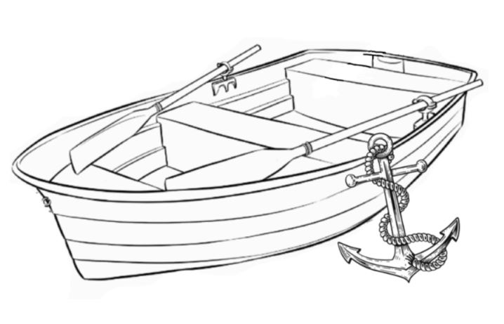
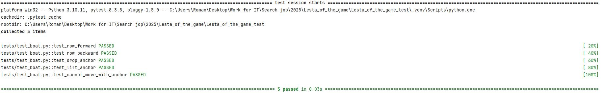

# Тестовое задание на позицию Trainee Automation QA Specialist(Леста Игры)

## Задание:

Вам в работу поступило задание: "Реализовать и протестировать вёсельную лодку".
Составляющие части вёсельной лодки, которую нужно реализовать, изображены на картинке:



Задание можно разделить на 3 подзадачи:
1. Тест-кейсы
Необходимо, опираясь только на изображение, составить тест-кейсы системного, интеграционного и 
функционального уровней для вёсельной лодки.
Формат тест-кейсов на ваше усмотрение.
2. Реализация
Реализовать, функциональность вёсельной лодки, изображенной на картинке. Реализация должна 
представлять из себя API (не веб), т.е. сущность или сущности с набором открытых методов. 
Визуальную часть реализовывать не нужно. 
Набор объектов для реализации, а также перечень открытых методов определить самостоятельно.
Требования:
•	Версия Python должна быть не ниже 3.10.
•	Задание нужно выполнять с использованием системы контроля версий.
•	На проверку прислать ссылку на ваш удаленный репозиторий.
3. Автотесты
Самостоятельно определить, какие тест-кейсы из задания 1 можно и нужно автоматизировать. Написать 
на эти тест-кейсы автотесты.
Требования:
•	Для автотестов использовать фреймворк Pytest.

## Решение

В рамках данного задания были выполнены следующие шаги:

1. **Создание тест-кейсов**

   Разработаны тест-кейсы на трёх уровнях:
   - **Системные**: Проверка плавучести, вместимости и устойчивости лодки.
   - **Интеграционные**: Взаимодействие лодки с якорем и вёслами.
   - **Функциональные**: Проверка работы функций гребли и использования якоря.

   Тест-кейсы представлены в документе: Тест_кейсы.docx.

2. **Реализация API**

   Реализован программный интерфейс (API) на Python 3.10, описывающий сущность лодки с набором методов:
   - `row_forward(strokes)` — гребля вперёд;
   - `row_backward(strokes)` — гребля назад;
   - `drop_anchor()` — спуск якоря;
   - `lift_anchor()` — подъём якоря.

   API представлен в виде классов и методов, доступных для использования другими компонентами или внешними системами.

3. **Автоматизированные тесты**
   - Автотесты написаны с использованием фреймворка `pytest`.
   - Автоматизированы только те тест-кейсы, которые можно эффективно покрыть автотестами (5 из 10). 
Остальные тест-кейсы предназначены для ручного тестирования.

Для запуска всех тестов выполните следующие шаги:

**1.** Убедитесь, что у вас установлен pytest:

```bash
pip install pytest
```

**2.** Перейдите в корневой каталог вашего проекта и выполните команду:

```bash
pytest
```

Эта команда автоматически найдёт и выполнит все тесты из файлов, имя которых соответствует шаблону:

- `test_*.py`
- `*_test.py`

расположенных в каталоге проекта и его подкаталогах.

Если тесты находятся в специальной директории (например, `tests`), вы можете явно указать её:

```bash
pytest tests/
```

**3.** Чтобы получить более подробную информацию о результатах запуска тестов, используйте флаг `-v` (verbose):

```bash
pytest -v
```

### Скриншот



Проект выполнен с использованием системы контроля версий Git. 
Исходный код доступен в репозитории: .
